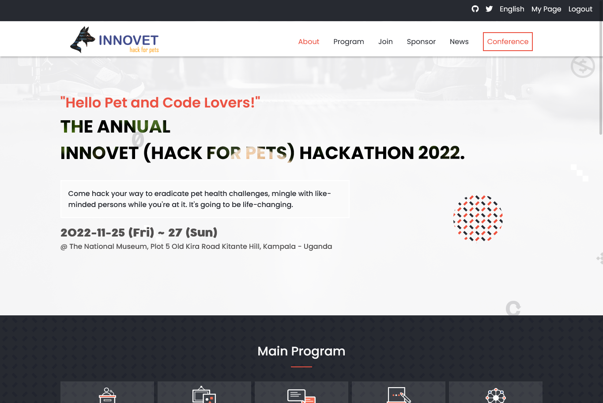
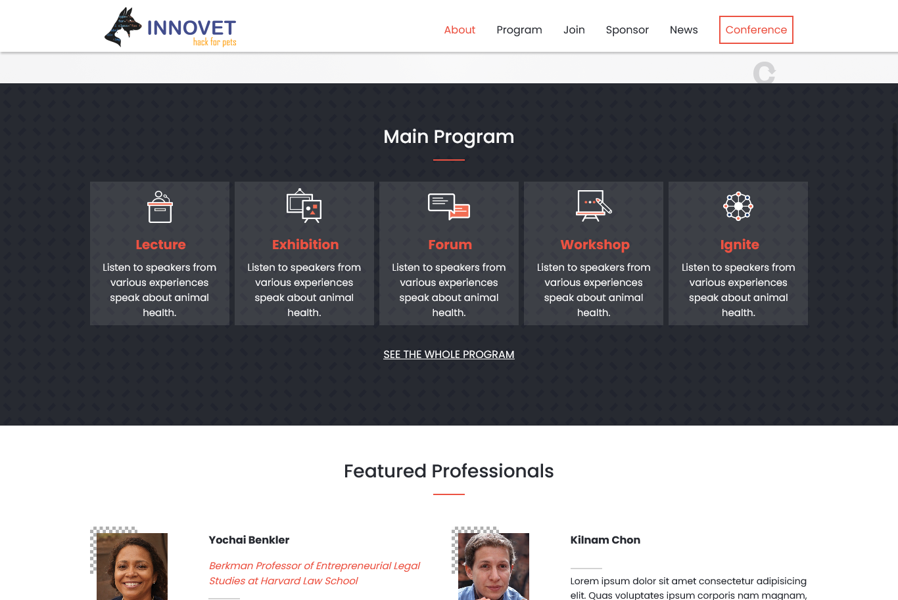
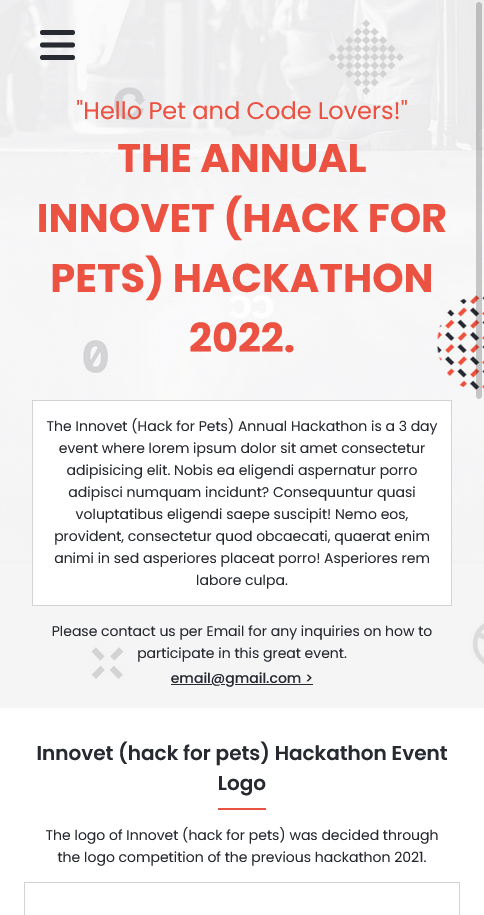
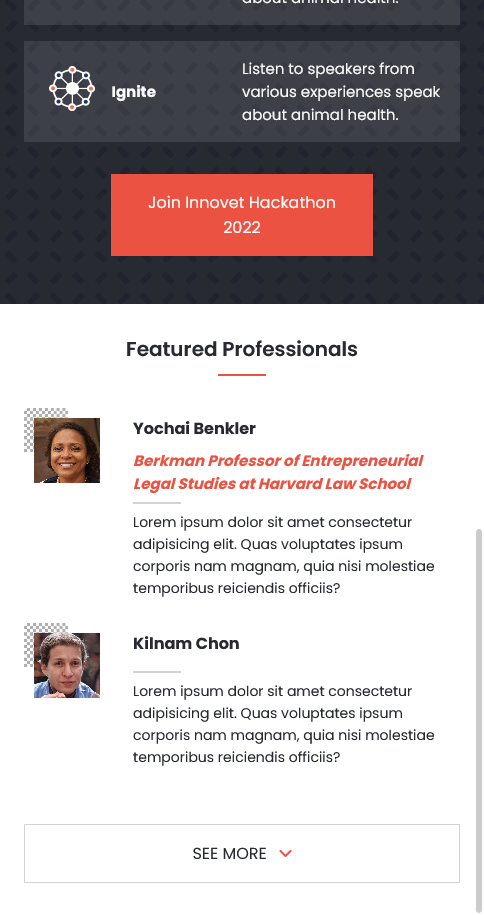

# Capstone-Project: INNOVET (hack for pets)

This capstone project is built based on an online website design for a conference provided by Microverse for personalization.
Below are some screenshots of the project.







 ## Learning objectives

 - Use semantic HTML tags.
 - Apply best practices in HTML code.
 - Use CSS selectors correctly.
 - Use CSS box model.
 - Use Flexbox to place elements in the page.
 - Demonstrate ability to create UIs adaptable to different screen sizes using media queries.
 - Use GitHub Pages to deploy web pages.
 - Apply JavaScript best practices and language style guides in code.
 - Use JavaScript to manipulate DOM elements.
 - Use JavaScript events.
 - Use objects to store and access data.
 - Communicate technical concepts to other technical people.

## Built With

- CSS, HTML, JavaScript

## Live Demo

[Live Demo Link](https://normainobary2021.github.io/capstone-one/)

## Video Presentation

[Video Presentation Link](https://www.loom.com/share/a5fd639970ec41b2b8351b64aefb5e37)

## Getting Started

### To launch the project locally:

#### Step 1:
- Clone this repo locally using this git command:

```bash
git clone https://github.com/normainobary2021/capstone-one.git
```

#### Step 2:

- Open index.html or about.html file in your browser and open in liveserver
- Use developer tools in order to view the Mobile version

## Authors

👤 Norman Ainobushoborozi

- GitHub: [@normainobary2021](https://github.com/normainobary2021)
- LinkedIn: [norman-ainobushoborozi](https://www.linkedin.com/in/norman-ainobushoborozi/)
- Twitter: [@NormanAinobush2](https://twitter.com/NormanAinobush2)


## 🤝 Contributing

Contributions, issues and feature requests are welcome!


## Show your support

Give a ⭐️ if you like this project!

## Acknowledgments

### Design Cindy Shin


- behance: [Cindy Shin](https://www.behance.net/adagio07)
- LinkedIn: [Cindy Shin](https://www.linkedin.com/in/adagio07/)
- dribbble: [Cindy Shin](https://dribbble.com/adagio07/collections)

## 📝 License

This project is [MIT](./MIT.md) licensed.
